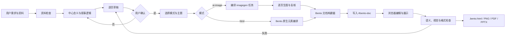

# Bento 原生 PPT Skill 重构设计

## 1. 目标

重构 `skills/presentation/create-editable-ppt`，删除现有八主题和自研播放文档，保留两条互斥路线：

1. `ai-image`：`imagegen` 生成完整 16:9 页面图片。
2. `html`：不调用生图，使用 Bento 原生文字、形状、SVG、图表和表格。

两条路线都生成真正的 `bento/slides` 单文件文档。`.bento.html` 是唯一可修改母版，PNG、PDF、PPTX 是派生导出物。

## 2. 完整流程



草稿确认是生成门。草稿必须包含中心含义、叙事逻辑、页数和每页的作用、主张、准确文字、证据、视觉说明、衔接。未确认时不调用 `imagegen`，也不构建最终 Bento 文档。

## 3. 主题调研与去重

主题资料分成两层：

- 原始清单：保存上游主题名、固定 commit、证据路径、视觉特征和适用内容，保证参考主题可追溯。
- 规范主题：按视觉语法去重，供实际生成使用；原始主题通过 alias 映射到主题家族和变体。

视觉指纹包含：明暗、字体关系、网格与空间结构、材质、几何、图片语法、动效、内容密度。颜色相近不是合并理由；只有核心构图和表达逻辑相同才归为同一家族。

图片清单覆盖：`guizang-ppt-skill`、`codex-ppt-skill`、`GordenSuperPPTSkills`、`gpt-image2-ppt-skills`、`wuming-cyan-circuit-launch-ppt`、`wuming-ai-ppt-cover`。

HTML 清单覆盖：`frontend-slides`、`visual-explainer`、`open-codesign`、`html-ppt-skill`、`open-slide`、`dashi-ppt-skill`、`beautiful-html-templates`、`baoyu-design`。Bento 是输出格式和编辑器，不计作主题库。

主题目录使用三个文件：

- `references/image-theme-inventory.json`
- `references/html-theme-inventory.json`
- `assets/themes/theme-catalog.json`

`theme-catalog.json` 分别保存 `ai-image` 与 `html` 配方。每个规范主题包含 `id`、`label`、`mode`、`aliases`、`source_refs`、`best_for`、`avoid_for`、`density`、`palette`、`typography`、`composition`、`imagery_or_elements`、`motion` 和模式专属 recipe。

## 4. Bento 文档契约

最终文件保留 Bento shell，只替换明文块：

```html
<script type="application/bento+json" id="bento-doc">...</script>
```

JSON 必须满足：

- `format: "bento/slides"`、`version: 1`。
- `size`、`theme`、`slides` 完整。
- 新文件不伪造 `docId`；编辑已有文件时保留 `docId`。
- 所有 `<` 写成 `\u003c`，不得出现字面量 `</script>`。
- 素材以内嵌 data URI 或 `asset:<key>` 引用，核心编辑和展示不依赖网络。
- 元素 ID 稳定；跨页对象需要 Morph 时复用 ID。
- 每页保留 notes，图片模式也保留准确文字和生成信息作为元数据。

新建文档优先使用仓库内固定、校验过的 Bento shell；也允许 `--bento-shell` 指定更新版本。构建器只替换 `#bento-doc`，不重新拼接运行时。

## 5. 两种渲染路线

### 5.1 AI 图片

每页生成一张完整 PNG，Bento 页面只放一个全幅 image element。用户可以在 Bento 中替换图片、调整顺序、复制、删除、隐藏页面和修改备注，但不能单独修改图片里的文字或图表。

`imagegen` 是唯一生图入口。调用前检查配置状态，仅报告变量是否存在；密钥不得写入对话、日志、JSON、提示词或提交。生成失败只重试失败页，记录 prompt、模型、尺寸、状态和次数。

### 5.2 纯 HTML

不调用 `imagegen`，也不把页面截图作为编辑母版。页面使用 Bento 原生 text、shape、svg、chart、table 和必要的用户素材。流程、对比、数据和层级关系必须选择对应元素，不能退化成长段文字或卡片堆叠。

主题 recipe 负责字体、颜色、网格、装饰、页面角色和动效。复杂装饰可以是 SVG，但准确文字、表格、图表和基础图形保持独立元素。

## 6. 修改与导出

浏览器编辑直接修改 Bento JSON。已有 `.bento.html` 的更新只替换文档块，并保留未知字段，避免破坏后续格式扩展。

导出规则：

- `.bento.html`：主交付，可编辑、可展示、可自保存。
- PNG/PDF：浏览器真实渲染后的静态结果。
- PPTX：图片模式每页放完整 PNG；HTML 模式第一版使用截图页并写入 notes。PPTX 不宣称对象级可编辑，修改应回到 `.bento.html`。

## 7. 检查与兜底

输入检查：资料缺失时列出缺口；事实不足时缩短页数或将页面标为 unresolved；没有依据时不生成真实数据、产品截图、Logo、引文或研究结论。

差异化检查：

- 封面和章节：中心主张、层级、视觉锚点。
- 数据：来源、单位、数值和图表类型。
- 对比：比较维度必须对齐。
- 流程：顺序、责任和方向清楚。
- 图片页：文字准确、主体与裁切合理、无水印和伪造信息。
- HTML 页：文本可编辑、元素未越界、无重叠、主题与动效一致。

格式检查：Bento 块可解析、`<` 已转义、页面数一致、素材引用完整、现有 `docId` 未改变、文件在 `file://` 下可打开和编辑。

## 8. 样例

使用同一个“AI 原生知识工作流”内容草稿生成两个 Bento 样例：

- `image-theme-showcase.bento.html`：每个规范图片主题一页完整生图。
- `html-theme-showcase.bento.html`：每个规范 HTML 主题一页原生 Bento 页面。

两个样例都包含文字、视觉和 notes，并通过桌面与移动视口检查。图片样例需要本地 imagegen 配置；配置不可用时保留任务清单和明确状态，不用占位图冒充结果。

## 9. 不做的内容

- 不保留旧八主题作为兼容别名。
- 不维护 `image-ppt-doc` 或第二套自研编辑器。
- 不把 AI 图片和 HTML 元素混在同一 deck。
- 不做图片转原生 PPTX 对象重建。
- 不复制外部仓库的模板代码、图片或受限资产；只保存主题事实、来源和重新编写的 recipe。
