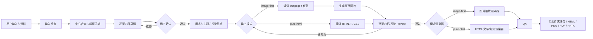

# 架构与集成



## 数据流

`outline_draft.json` 是用户确认前的计划，`deck_spec.json` 是确认后的内容、模式与主题源，`generation_manifest.json` 是生成任务与状态源。`image-first` 将完整页面保存到 `slides/`；`pure-html` 不保存图片，manifest 直接把页面标记为 `pass`。渲染器只消费 JSON，不从已生成的 HTML 反推内容。

最终 `bundle` 生成 Bento-inspired 单文件：

```html
<script type="application/image-ppt+json" id="image-ppt-doc">
{"format":"image-ppt","version":1,"mode":"pure-html","assets":{},"slides":[{"id":"s01","exact_text":["标题","支持句"]}]}
</script>
<script>/* offline runtime: read JSON, render thumbnails and presentation */</script>
```

JSON 是唯一事实源，`<` 在嵌入前转义为 `\\u003c`，因此文件可离线打开且不会因 `</script>` 破坏。`image-first` 的 `image` 是完整页面；`pure-html` 没有 `image`、`visual` 或图片资产，`exact_text` 由运行时创建 HTML 文字，CSS 只提供抽象装饰。`id`、`visual_anchor_id`、`continuity_group` 和 `transition` 保留跨页连续性；修改时只重生成受影响的页面或重渲染页面。

## 集成边界

Skill 通过宿主的 `imagegen` 能力生成图片。内置工具优先；只有用户明确允许时才使用本机 CLI，并通过 `doctor` 检查本地配置。Codex、Agents、Claude 或 QoderWork 只需要能运行 Node.js、调用 imagegen，并打开本地 HTML。

思想来源：Bento 的单文件、JSON source of truth、离线资产内嵌和统一渲染器；`ppt-master`、`frontend-slides` 与 `html-ppt-skill` 的简洁播放与动效思路；参考仓库的主题与内容策略只作为提示词配方，不复制代码或模板。
