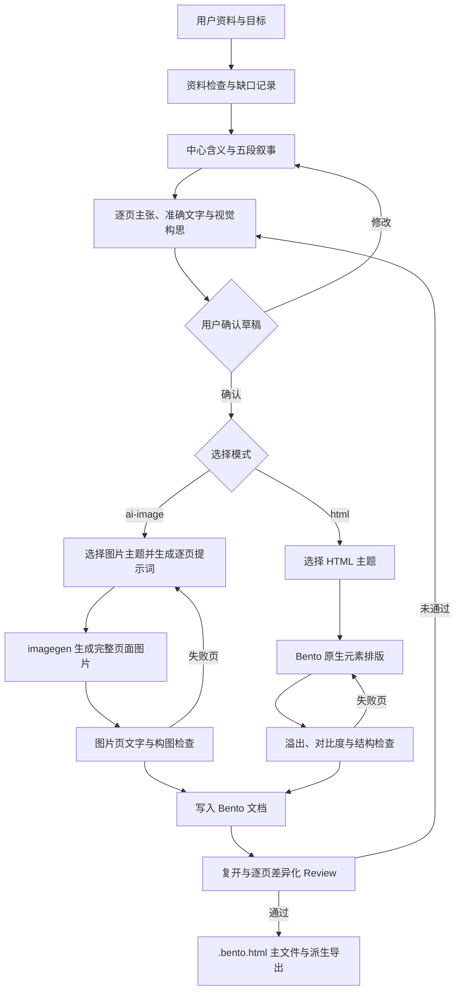

# 工作流

## 草稿门禁

生成前先确定大致页数。每页只保留一个主张，并给出准确文字、证据状态和视觉构思。`ai-image` 在用户确认草稿之前不得调用生图；`html` 也不得绕过草稿直接排版。

## Review

逐页检查不是统一打勾。封面检查中心信息；数据页检查来源、单位与量级；流程页检查顺序和责任；对比页检查维度对齐；图片页检查主体、裁切、准确文字和多余文字；结尾页检查行动是否明确。任何阻断项未解决时，不得标记为完成。
